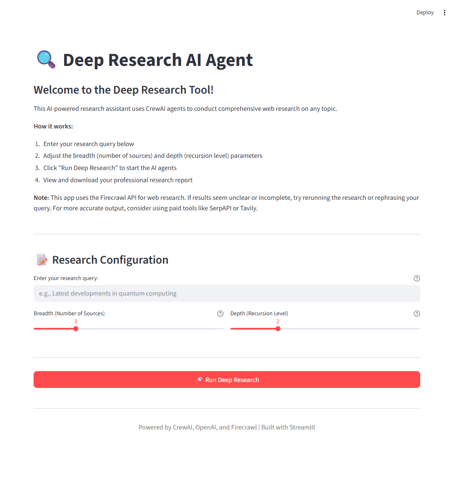

# Deep Research AI Agent

An AI-powered research assistant that automates deep web exploration, summarization, and report generation using CrewAI, Firecrawl, and OpenAI.

## Application Preview



## Project Description

In today’s information-rich world, conducting deep, focused research across the web can be time-consuming and overwhelming. The **Deep Research AI Agent** is designed to automate this process through intelligent multi-agent orchestration. By simulating a human researcher’s iterative exploration, the assistant asks refined questions, analyzes multiple sources, summarizes insights, and compiles professionally formatted reports.

This tool leverages **CrewAI** for agent coordination, **Firecrawl** for advanced web search, and **OpenAI's GPT models** for natural language understanding and synthesis.

## Features

- **Deep Topic Research**: Automated multi-step research process powered by intelligent agents.
- **Configurable Breadth & Depth**: Fine-tune research parameters for breadth (number of sub-queries) and depth (recursion levels).
- **Multi-Agent Workflow**:
  - **Research Agent**: Fetches and extracts relevant data using Firecrawl.
  - **Summarizer Agent**: Condenses findings into structured, actionable insights.
  - **Presenter Agent**: Formats output into clean, professional reports.
- **Report Generation**: Preview summaries in the UI and download full reports as PDFs.
- **Clean Markdown Output**: Automated cleaning of web-scraped data for readability.

## Technologies

- **Python**: Core programming language.
- **Streamlit**: Interactive frontend interface.
- **CrewAI**: Multi-agent orchestration framework.
- **LangChain**: Framework for LLM integration.
- **OpenAI API**: Powering natural language processing.
- **Firecrawl**: Web-based search and metadata extraction.
- **ReportLab**: Dynamic PDF report generation.

## Prerequisites

- **Intermediate Python Skills**: Comfort with Python scripting and environment management.
- **API Keys**:
  - [OpenAI API Key](https://platform.openai.com/)
  - [Firecrawl API Key](https://www.firecrawl.dev/)
- **Basic LLM Understanding**: Familiarity with how Large Language Models work.

## Installation

1. **Clone the Repository**:
   ```bash
   git clone https://github.com/mobatusi/deep-research-ai-agent.git
   cd deep-research-ai-agent
   ```

2. **Set Up a Virtual Environment**:
   ```bash
   python -m venv venv
   source venv/bin/scripts/activate  # On Windows use `venv\Scripts\activate`
   ```

3. **Install Dependencies**:
   ```bash
   pip install -r requirements.txt
   ```

4. **Configure Environment Variables**:
   Create a `.env` file in the root directory and add your keys:
   ```env
   OPENAI_API_KEY=your_openai_key_here
   FIRECRAWL_API_KEY=your_firecrawl_key_here
   ```

## Quick Start

Run the application using Streamlit:

```bash
streamlit run app.py
```

## Usage

1. **Enter Topic**: Type your research topic into the main search bar.
2. **Set Configuration**: Adjust the breadth and depth sliders in the sidebar.
3. **Trigger Research**: Click "Start Research" and monitor the progress tracker.
4. **Review & Export**: Preview the generated report and click "Download Full Report (PDF)" to save a copy locally.

## Project Structure

The project follows a modular structure inspired by the **MVC (Model-View-Controller)** pattern:

- `app.py`: Main entry point for the Streamlit GUI.
- `agents/`: Definitions for Research, Summarizer, and Presenter agents.
- `tasks/`: Configuration for agent-specific tasks.
- `tools/`: Integration with Firecrawl and other utility tools.
- `utils/`: Data cleaning and PDF generation utilities.

## References

- [Educative Project: Deep Research AI Agent](https://www.educative.io/projects/deep-research-through-an-ai-agent-using-openai)
- [CrewAI Documentation](https://docs.crewai.com/)
- [Streamlit Documentation](https://docs.streamlit.io/)
- [OpenAI API Reference](https://platform.openai.com/docs/)
- [Firecrawl Documentation](https://docs.firecrawl.dev/)